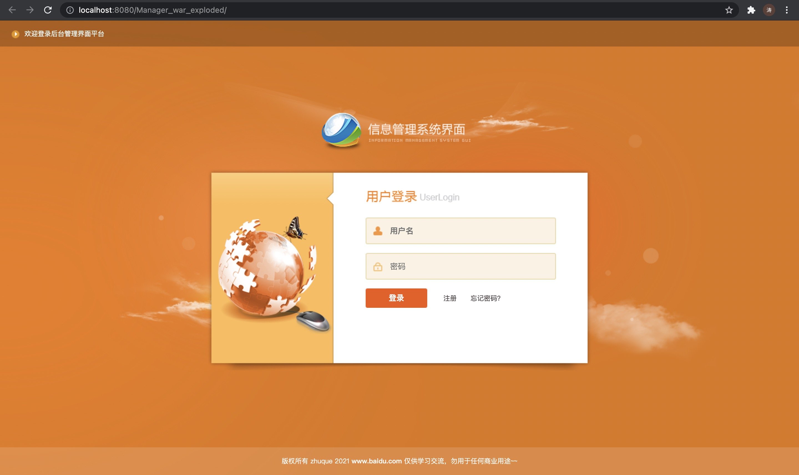

# 信息管理系统

## 技术需求：

- Servlet
- jsp
- mvc
- jdbc

## 软件需求

- 开发工具：IDEA
- 数据库：MySQL
- 服务器：tomcat
- 浏览器：Chrome

## 硬件需求

- 一台电脑

## 功能需求

- [用户登录](doc/用户登录.md)
- [用户注册](doc/用户注册.md)
- [用户退出](doc/用户退出.md)
- [查看个人信息](doc/查看个人信息.md)
- [修改密码](doc/修改密码.md)
- [查询所有用户信息](doc/查询所有用户信息.md)

## 数据库设计

| Field | Type         | Null | Key | Default | Extra          |
|-------|--------------|------|-----|---------|----------------|
| uid   | int          | NO   | PRI | NULL    | auto_increment |
| uname | varchar(100) | NO   |     | NULL    |                |
| pwd   | varchar(100) | NO   |     | NULL    |                |
| sex   | char(2)      | NO   |     | NULL    |                |
| age   | int          | YES  |     | NULL    |                |
| birth | date         | YES  |     | NULL    |                |

## 代码规范

命名规范：

- 包名：com.xxglxt.*
- 类名：首字母大写，见名知意
- 变量名和方法名：驼峰原则

注释规范：

- 方法功能注释
- 方法体核心位置必须有说明注释

日志规范：

- 使用log4j进行日志输出
- 数据流转位置必须有后台输出语句

视频教程：https://www.bilibili.com/video/BV1nt411d7Ej?p=40
tomcat配置：https://www.bilibili.com/video/BV1gJ411q7Lf

## 完成度

上述功能已全部完成，在IDEA中直接运行即可看到登录界面并使用相关功能

