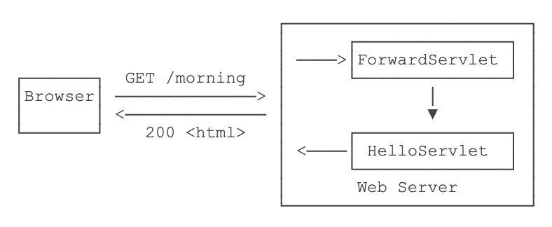

# 重定向和请求转发比较

## 重定向

重定向是指当浏览器请求一个URL时，服务器告诉浏览器请求URL变更，让浏览器重新发起
一次请求。也就是说这里面包含两次HTTP请求。

比如，我们已经编写了一个能处理/hello的HelloServlet，如果收到的路径为/hi，
希望能重定向到/hello，可以再编写一个RedirectServlet：

```java
@WebServlet(urlPatterns = "/hi")
public class RedirectServlet extends HttpServlet {
    protected void doGet(HttpServletRequest req, HttpServletResponse resp) throws ServletException, IOException {
        // 构造重定向的路径:
        String name = req.getParameter("name");
        String redirectToUrl = "/hello" + (name == null ? "" : "?name=" + name);
        // 发送重定向响应:
        resp.sendRedirect(redirectToUrl);
    }
}
```

如果浏览器发送GET /hi请求，RedirectServlet将处理此请求。由于
RedirectServlet在内部又发送了重定向响应，因此，浏览器会收到如下响应：

```
HTTP/1.1 302 Found
Location: /hello
```

当浏览器收到302响应后，它会立刻根据Location的指示发送一个新的GET /hello请求，
这个过程就是重定向：


观察Chrome浏览器的网络请求，可以看到**两次**HTTP请求：


注意：重定向之后浏览器URL自动更新为/hello。

重定向有两种：一种是302响应，称为临时重定向，一种是301响应，称为永久重定向。
两者的区别是，如果服务器发送301永久重定向响应，浏览器会缓存/hi到/hello这个重
定向的关联，下次请求/hi的时候，浏览器就直接发送/hello请求了。

重定向有什么作用？重定向的目的是当Web应用升级后，如果请求路径发生了变化，可以
将原来的路径重定向到新路径，从而避免浏览器请求原路径找不到资源。借助
resp.sendRedirect(String path)可实现重定向。

若想在重定向的两次HTTP请求中共享信息，可借助session。

## 请求转发

Forward是指内部转发。当一个Servlet处理请求的时候，它可以决定自己不继续处理，
而是转发给另一个Servlet处理。

例如，我们已经编写了一个能处理/hello的HelloServlet，继续编写一个能处理
/morning的ForwardServlet：

```java
@WebServlet(urlPatterns = "/morning")
public class ForwardServlet extends HttpServlet {
    protected void doGet(HttpServletRequest req, HttpServletResponse resp) throws ServletException, IOException {
        req.getRequestDispatcher("/hello").forward(req, resp);
    }
}
```

ForwardServlet在收到请求后，它并不自己发送响应，而是把请求和响应都转发给
路径为/hello的Servlet，即下面的代码：

`req.getRequestDispatcher("/hello").forward(req, resp);`

后续请求的处理实际上是由HelloServlet完成的。这种处理方式称为转发（Forward），
我们用流程图画出来如下：



转发和重定向的区别在于，转发是在Web服务器内部完成的，对浏览器来说，它只发出了
**一个**HTTP请求：


注意到使用转发的时候，浏览器的地址栏路径仍然是/morning，浏览器并不知道该请求
在Web服务器内部实际上做了一次转发。

## 路径

### 重定向路径总结

相对路径：从当前请求的路径查找资源的路径。如果servlet别名包含目录，则jsp先提
交form表单再sendRedirect重定向时，会造成路径冗余，资源查找失败

绝对路径：/虚拟项目名/资源路径，第一个/表示服务器根目录，即
**http://localhost:8080/**


### 请求转发路径总结
绝对路径：/资源路径，第一个/表示项目根目录，即
**http://localhost:8080/Manager_war_exploded/** ，注意和重定向绝对路径
的区分

## 总结

- 当用户在浏览器点击刷新的时候，会重新提交最近一次的HTTP请求，所以如果是转账这样
的敏感操作，一定要使用重定向，避免刷新一次转一次钱这样的情况。如果最近一次
HTTP请求中包含form表单，会发现每次刷新页面浏览器都会提醒你是否继续操作，这就是
form表单的重复提交。


- 不论是重定向还是请求转发，都应使用绝对路径